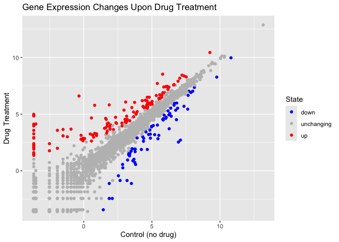

# Class 5: Data Viz with ggplot
Josie (A11433761)

**base R** `plot()`

``` r
plot(cars)
```


**ggplot2** Before I can use any add-on package like this, I must
install it. `install.packages("ggplot2")` command/function Then to use
the package, I need to load it with a `library(ggplot2)` call

``` r
library(ggplot2)
ggplot(cars) +
  aes(x=speed, y=dist) + 
  geom_point()
```


For “simple” plots, base R will be much shorter than ggplot code.

Let’s fit a model and show it on my plot.

``` r
ggplot(cars) +
  aes(x=speed, y=dist) + 
  geom_point() + 
  geom_smooth()
```

    `geom_smooth()` using method = 'loess' and formula = 'y ~ x'


**data:** data.frame with the numbers you want to plot **aes:** -thetics
mapping of your data columns to your plot **geom:** `geom_point()`,
`geom_line()`. `geom_col()`

``` r
mtcars
```

                         mpg cyl  disp  hp drat    wt  qsec vs am gear carb
    Mazda RX4           21.0   6 160.0 110 3.90 2.620 16.46  0  1    4    4
    Mazda RX4 Wag       21.0   6 160.0 110 3.90 2.875 17.02  0  1    4    4
    Datsun 710          22.8   4 108.0  93 3.85 2.320 18.61  1  1    4    1
    Hornet 4 Drive      21.4   6 258.0 110 3.08 3.215 19.44  1  0    3    1
    Hornet Sportabout   18.7   8 360.0 175 3.15 3.440 17.02  0  0    3    2
    Valiant             18.1   6 225.0 105 2.76 3.460 20.22  1  0    3    1
    Duster 360          14.3   8 360.0 245 3.21 3.570 15.84  0  0    3    4
    Merc 240D           24.4   4 146.7  62 3.69 3.190 20.00  1  0    4    2
    Merc 230            22.8   4 140.8  95 3.92 3.150 22.90  1  0    4    2
    Merc 280            19.2   6 167.6 123 3.92 3.440 18.30  1  0    4    4
    Merc 280C           17.8   6 167.6 123 3.92 3.440 18.90  1  0    4    4
    Merc 450SE          16.4   8 275.8 180 3.07 4.070 17.40  0  0    3    3
    Merc 450SL          17.3   8 275.8 180 3.07 3.730 17.60  0  0    3    3
    Merc 450SLC         15.2   8 275.8 180 3.07 3.780 18.00  0  0    3    3
    Cadillac Fleetwood  10.4   8 472.0 205 2.93 5.250 17.98  0  0    3    4
    Lincoln Continental 10.4   8 460.0 215 3.00 5.424 17.82  0  0    3    4
    Chrysler Imperial   14.7   8 440.0 230 3.23 5.345 17.42  0  0    3    4
    Fiat 128            32.4   4  78.7  66 4.08 2.200 19.47  1  1    4    1
    Honda Civic         30.4   4  75.7  52 4.93 1.615 18.52  1  1    4    2
    Toyota Corolla      33.9   4  71.1  65 4.22 1.835 19.90  1  1    4    1
    Toyota Corona       21.5   4 120.1  97 3.70 2.465 20.01  1  0    3    1
    Dodge Challenger    15.5   8 318.0 150 2.76 3.520 16.87  0  0    3    2
    AMC Javelin         15.2   8 304.0 150 3.15 3.435 17.30  0  0    3    2
    Camaro Z28          13.3   8 350.0 245 3.73 3.840 15.41  0  0    3    4
    Pontiac Firebird    19.2   8 400.0 175 3.08 3.845 17.05  0  0    3    2
    Fiat X1-9           27.3   4  79.0  66 4.08 1.935 18.90  1  1    4    1
    Porsche 914-2       26.0   4 120.3  91 4.43 2.140 16.70  0  1    5    2
    Lotus Europa        30.4   4  95.1 113 3.77 1.513 16.90  1  1    5    2
    Ford Pantera L      15.8   8 351.0 264 4.22 3.170 14.50  0  1    5    4
    Ferrari Dino        19.7   6 145.0 175 3.62 2.770 15.50  0  1    5    6
    Maserati Bora       15.0   8 301.0 335 3.54 3.570 14.60  0  1    5    8
    Volvo 142E          21.4   4 121.0 109 4.11 2.780 18.60  1  1    4    2

``` r
ggplot(mtcars) +
  aes(x=mpg, y=disp, size=hp)+
  geom_point( color="blue") 
```


``` r
ggplot(cars) +
  aes(x=speed, y=dist) + 
  geom_point() + 
  geom_smooth(method="lm", se=FALSE)
```

    `geom_smooth()` using formula = 'y ~ x'


``` r
url <- "https://bioboot.github.io/bimm143_S20/class-material/up_down_expression.txt"
genes <- read.delim(url)
head(genes)
```

            Gene Condition1 Condition2      State
    1      A4GNT -3.6808610 -3.4401355 unchanging
    2       AAAS  4.5479580  4.3864126 unchanging
    3      AASDH  3.7190695  3.4787276 unchanging
    4       AATF  5.0784720  5.0151916 unchanging
    5       AATK  0.4711421  0.5598642 unchanging
    6 AB015752.4 -3.6808610 -3.5921390 unchanging

``` r
nrow(genes)
```

    [1] 5196

``` r
ncol(genes)
```

    [1] 4

``` r
table(genes$State)
```


          down unchanging         up 
            72       4997        127 

``` r
table(genes$State)/nrow(genes)
```


          down unchanging         up 
    0.01385681 0.96170131 0.02444188 

``` r
p<-ggplot(genes)+
  aes(x=Condition1,y=Condition2, col=State)+
  geom_point()
p + scale_colour_manual(values=c("blue","gray","red"))+
  labs(title="Gene Expression Changes Upon Drug Treatment", x="Control (no drug)", y="Drug Treatment")
```


