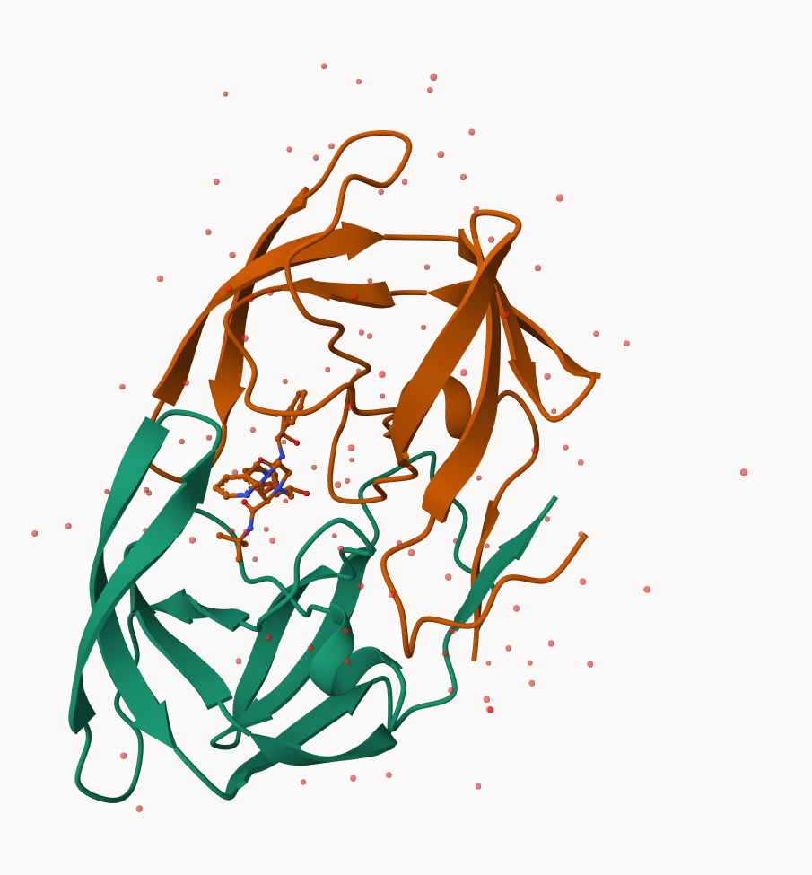
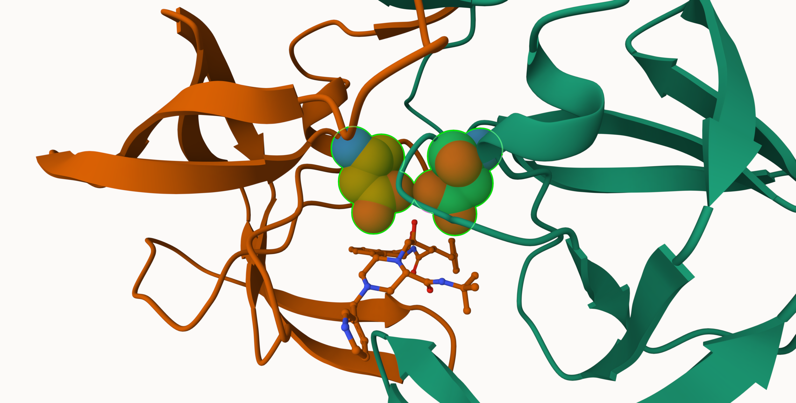
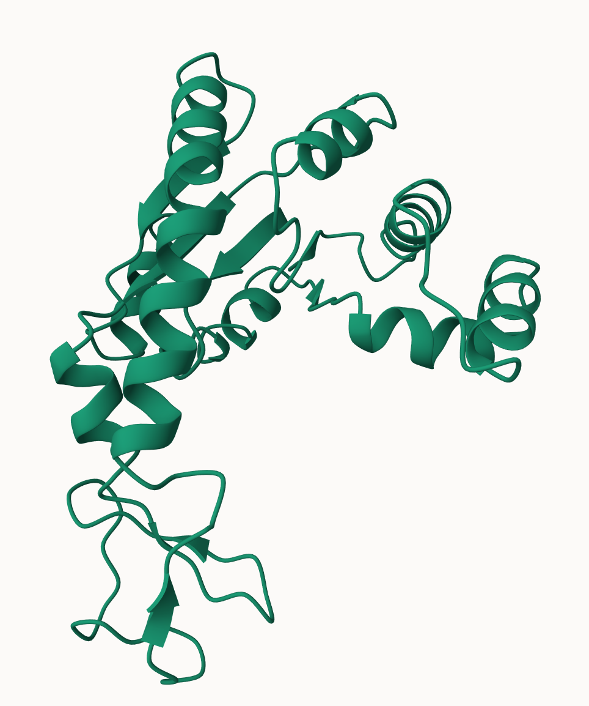

# Class 10: Structural Bioinfo. Part 1
Josie (A11433761)

## PDB statistics

``` r
PDB_data<-"Data Export Summary.csv"
PDBstats<-read.csv(PDB_data, row.names=1)
head(PDBstats)
```

                              X.ray     EM    NMR Multiple.methods Neutron Other
    Protein (only)          167,317 15,698 12,534              208      77    32
    Protein/Oligosaccharide   9,645  2,639     34                8       2     0
    Protein/NA                8,735  4,718    286                7       0     0
    Nucleic acid (only)       2,869    138  1,507               14       3     1
    Other                       170     10     33                0       0     0
    Oligosaccharide (only)       11      0      6                1       0     4
                              Total
    Protein (only)          195,866
    Protein/Oligosaccharide  12,328
    Protein/NA               13,746
    Nucleic acid (only)       4,532
    Other                       213
    Oligosaccharide (only)       22

``` r
library(readr)
pdbstats<-read_csv("Data Export Summary.csv")
```

    Rows: 6 Columns: 8
    ── Column specification ────────────────────────────────────────────────────────
    Delimiter: ","
    chr (1): Molecular Type
    dbl (3): Multiple methods, Neutron, Other
    num (4): X-ray, EM, NMR, Total

    ℹ Use `spec()` to retrieve the full column specification for this data.
    ℹ Specify the column types or set `show_col_types = FALSE` to quiet this message.

``` r
pdbstats
```

    # A tibble: 6 × 8
      `Molecular Type`   `X-ray`    EM   NMR `Multiple methods` Neutron Other  Total
      <chr>                <dbl> <dbl> <dbl>              <dbl>   <dbl> <dbl>  <dbl>
    1 Protein (only)      167317 15698 12534                208      77    32 195866
    2 Protein/Oligosacc…    9645  2639    34                  8       2     0  12328
    3 Protein/NA            8735  4718   286                  7       0     0  13746
    4 Nucleic acid (onl…    2869   138  1507                 14       3     1   4532
    5 Other                  170    10    33                  0       0     0    213
    6 Oligosaccharide (…      11     0     6                  1       0     4     22

``` r
15698/195866
```

    [1] 0.08014663

``` r
167317/195866
```

    [1] 0.8542422

``` r
sum(pdbstats$Total)
```

    [1] 226707

``` r
195866/(sum(pdbstats$Total))
```

    [1] 0.863961

Q1:EM (8.01%) X-ray (85.4%) Q2: Protein only (86.4%) Q3:HIV structures
(5)

## 2. Visualizing the HIV-1 protease structure





## Introduction to Bio3D in R

``` r
library(bio3d)
pdb<- read.pdb("1hsg")
```

      Note: Accessing on-line PDB file

``` r
pdb
```


     Call:  read.pdb(file = "1hsg")

       Total Models#: 1
         Total Atoms#: 1686,  XYZs#: 5058  Chains#: 2  (values: A B)

         Protein Atoms#: 1514  (residues/Calpha atoms#: 198)
         Nucleic acid Atoms#: 0  (residues/phosphate atoms#: 0)

         Non-protein/nucleic Atoms#: 172  (residues: 128)
         Non-protein/nucleic resid values: [ HOH (127), MK1 (1) ]

       Protein sequence:
          PQITLWQRPLVTIKIGGQLKEALLDTGADDTVLEEMSLPGRWKPKMIGGIGGFIKVRQYD
          QILIEICGHKAIGTVLVGPTPVNIIGRNLLTQIGCTLNFPQITLWQRPLVTIKIGGQLKE
          ALLDTGADDTVLEEMSLPGRWKPKMIGGIGGFIKVRQYDQILIEICGHKAIGTVLVGPTP
          VNIIGRNLLTQIGCTLNF

    + attr: atom, xyz, seqres, helix, sheet,
            calpha, remark, call

``` r
attributes(pdb)
```

    $names
    [1] "atom"   "xyz"    "seqres" "helix"  "sheet"  "calpha" "remark" "call"  

    $class
    [1] "pdb" "sse"

``` r
head(pdb$atom)
```

      type eleno elety  alt resid chain resno insert      x      y     z o     b
    1 ATOM     1     N <NA>   PRO     A     1   <NA> 29.361 39.686 5.862 1 38.10
    2 ATOM     2    CA <NA>   PRO     A     1   <NA> 30.307 38.663 5.319 1 40.62
    3 ATOM     3     C <NA>   PRO     A     1   <NA> 29.760 38.071 4.022 1 42.64
    4 ATOM     4     O <NA>   PRO     A     1   <NA> 28.600 38.302 3.676 1 43.40
    5 ATOM     5    CB <NA>   PRO     A     1   <NA> 30.508 37.541 6.342 1 37.87
    6 ATOM     6    CG <NA>   PRO     A     1   <NA> 29.296 37.591 7.162 1 38.40
      segid elesy charge
    1  <NA>     N   <NA>
    2  <NA>     C   <NA>
    3  <NA>     C   <NA>
    4  <NA>     O   <NA>
    5  <NA>     C   <NA>
    6  <NA>     C   <NA>

``` r
pdbseq(pdb)[25]
```

     25 
    "D" 

Q. How many amino acids are there? Sequence Length

``` r
length(pdbseq(pdb))
```

    [1] 198

## Predicting functional motions of a single structure

``` r
adk <- read.pdb("6s36")
```

      Note: Accessing on-line PDB file
       PDB has ALT records, taking A only, rm.alt=TRUE

``` r
adk
```


     Call:  read.pdb(file = "6s36")

       Total Models#: 1
         Total Atoms#: 1898,  XYZs#: 5694  Chains#: 1  (values: A)

         Protein Atoms#: 1654  (residues/Calpha atoms#: 214)
         Nucleic acid Atoms#: 0  (residues/phosphate atoms#: 0)

         Non-protein/nucleic Atoms#: 244  (residues: 244)
         Non-protein/nucleic resid values: [ CL (3), HOH (238), MG (2), NA (1) ]

       Protein sequence:
          MRIILLGAPGAGKGTQAQFIMEKYGIPQISTGDMLRAAVKSGSELGKQAKDIMDAGKLVT
          DELVIALVKERIAQEDCRNGFLLDGFPRTIPQADAMKEAGINVDYVLEFDVPDELIVDKI
          VGRRVHAPSGRVYHVKFNPPKVEGKDDVTGEELTTRKDDQEETVRKRLVEYHQMTAPLIG
          YYSKEAEAGNTKYAKVDGTKPVAEVRADLEKILG

    + attr: atom, xyz, seqres, helix, sheet,
            calpha, remark, call

``` r
#source("https://tinyurl.com/viewpdb")
#library(r3dmol)
#library(shiny)
#view.pdb(adk)
```

``` r
modes<-nma(adk)
```

     Building Hessian...        Done in 0.02 seconds.
     Diagonalizing Hessian...   Done in 0.462 seconds.

``` r
plot(modes)
```


``` r
mktrj(modes,file="adk.pdb")
```


