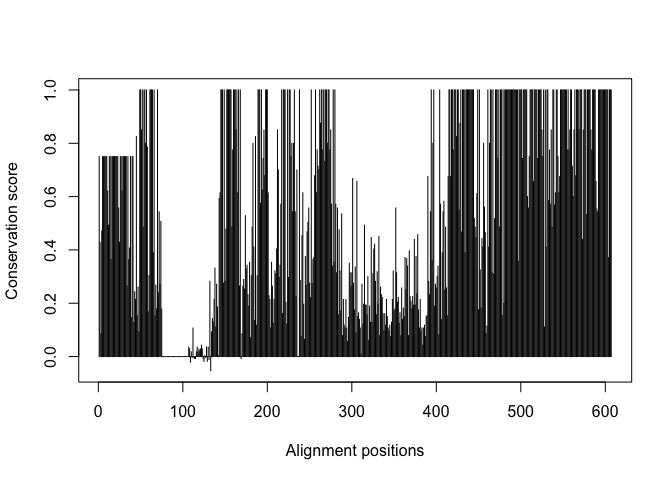
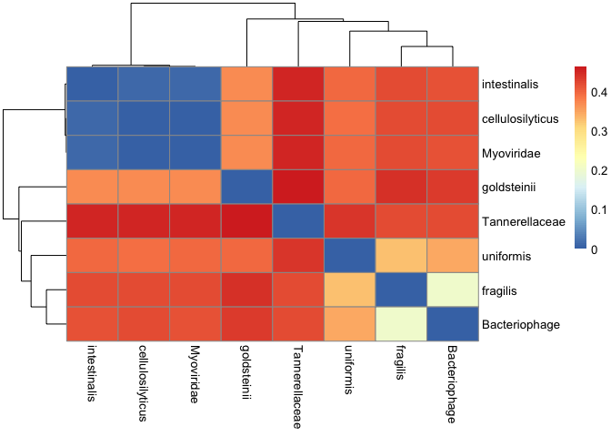

# Find-a-gene heatmap


``` r
library(bio3d)
inputfile<-"muscle_fasta2"
aln<-read.fasta(inputfile)
```

``` r
sim<-conserv(aln)
plot(sim, typ="h",xlab="Alignment positions", ylab="Conservation score")
```



``` r
inds<-order(sim,decreasing=TRUE)
head(sim[inds])
```

    [1] 1 1 1 1 1 1

``` r
positions<-data.frame(pos=1:length(sim),
                        aa=aln$ali[1,],
                        score=sim)

head(positions)
```

      pos aa      score
    1   1  M 0.75000000
    2   2  A 0.42857143
    3   3  V 0.08571429
    4   4  M 0.47142857
    5   5  K 0.75000000
    6   6  T 0.75000000

``` r
head( positions[inds,] )
```

       pos aa score
    49  49  P     1
    50  50  W     1
    52  52  I     1
    54  54  S     1
    55  55  M     1
    57  57  E     1

``` r
aa123(positions[inds,]$aa)[1:3]
```

    [1] "PRO" "TRP" "ILE"

``` r
library(pheatmap)

ide <- seqidentity(aln)
pheatmap((1-ide))
```


